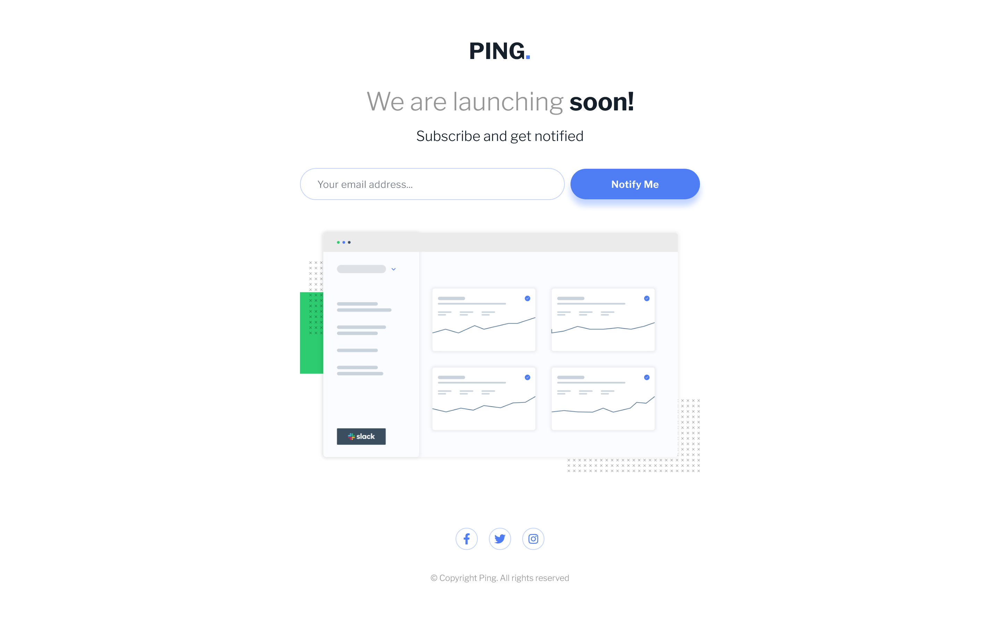

# Frontend Mentor - Ping single column solution

This is a solution to the [Ping single column challenge on Frontend Mentor](https://www.frontendmentor.io/challenges/ping-single-column-coming-soon-page-5cadd051fec04111f7b848da). Frontend Mentor challenges help you improve your coding skills by building realistic projects.

## Table of contents

- [Overview](#overview)
  - [Screenshot](#screenshot)
  - [Links](#links)
- [My process](#my-process)
  - [Built with](#built-with)
- [Author](#author)

## Overview

### Screenshot

### Links

- Solution URL: [Github Repo](https://github.com/agusthas/FEM_ping-coming-soon-page.git)
- Live Site URL: [Demo](https://agusthas.github.io/FEM_ping-coming-soon-page)

## My process

### Built with

- Semantic HTML5 markup
- CSS custom properties
- Mobile-first workflow
- TailwindCSS

## Author

- Frontend Mentor - [@agusthas](https://www.frontendmentor.io/profile/agusthas)
- Twitter - [@agusthas](https://www.twitter.com/agusthas)
